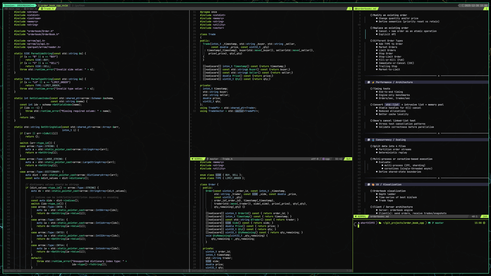

# .dotfiles

> Efficiency is intelligent laziness." — David Dunham"

Personal configuration files for my Linux workstation. 



## Core Stack

| Component | Choice | Description |
| :--- | :--- | :--- |
| **OS** | Linux (Ubuntu) | Stable base for research & trading strategies |
| **Window Manager** | [AwesomeWM](https://awesomewm.org/) | Lua-configured dynamic tiling window manager |
| **Multiplexer** | [Tmux](https://github.com/tmux/tmux) | Critical for session management & persistent workflows |
| **Terminal** | [Kitty](https://sw.kovidgoyal.net/kitty/) | GPU-accelerated (Alacritty config included as backup) |
| **Shell** | Zsh | Powered by Powerlevel10k & fzf |
| **Editor** | [Neovim](https://neovim.io/) | Heavily customized Lua config (Lazy.nvim) |

## 🛠 Configuration Highlights

### Tmux (Workflow Hub)
Tmux is the backbone of my terminal workflow, allowing for persistent sessions across projects.
* **Plugin Manager:** TPM (Tmux Plugin Manager) located in `.tmux/plugins`.
* **Config:** Custom keybindings in `.tmux.conf` for rapid pane navigation and layout switching, tailored to match Neovim split navigation.

### Neovim (The Engine)
My Neovim setup (`nvim/`) is designed for data science and low-latency coding:
* **Languages:** R (Nvim-R), Python (Pandas/Polars), and C++.
* **Package Manager:** Lazy.nvim for fast startup times.

### AwesomeWM & UI
* **Awesome:** Lua-based configuration located in `awesome/`.
* **Theming:**
    * **Polybar:** Configured in `polybar/` for status bar modules.
    * **GTK:** `gtk-4.0/` ensures UI consistency for GUI apps.
    * **Fonts:** Custom fonts managed in `.fonts/` (Bricolage Grotesque / JetBrains Mono).

### Custom Color Theme 
* Configured a personal theme based on [darkvoid.nvim theme](https://github.com/darkvoid-theme/darkvoid.nvim)

## Structure

```text
.
├── .fonts/            # Local font storage
├── .tmux/             # Tmux plugins directory
├── alacritty/         # Legacy terminal configuration
├── awesome/           # Window manager configuration
├── gtk-4.0/           # GTK 4.0 theme settings
├── kitty/             # Primary terminal configuration
├── nvim/              # Neovim configuration (Lua)
├── pictures/          # Screenshot of current setup
├── polybar/           # Polybar status bar configuration
├── .gitignore
├── .p10k.zsh          # Powerlevel10k shell theme
├── .tmux.conf         # Tmux dotfile configuration
├── .zshrc             # Zsh shell configuration
└── README.md
